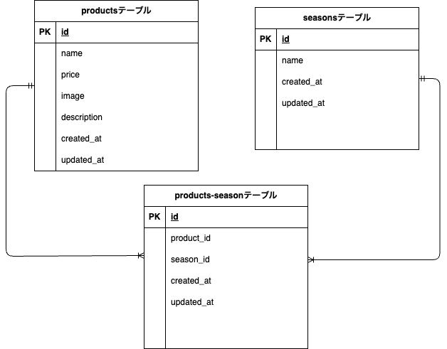

# もぎたて（mogitate）

## 環境構築

### Docker ビルド

1. git clone https://github.com/morikoshi2627/mogitate.git
2. cd mogitate
3. docker-compose build
4. docker-compose up -d
5. docker-compose exec php bash

### Laravel 環境構築

1. composer install
2. cp .env.example .env
3. php artisan key:generate
4. .env の DB 設定を以下のように修正  

   APP_URL=http://localhost:8081  

   DB_CONNECTION=mysql  
   DB_HOST=mysql  
   DB_PORT=3306  
   DB_DATABASE=mogitate_db  
   DB_USERNAME=mogitate_user  
   DB_PASSWORD=mogitate_pass  
   ```
5. php artisan migrate --seed

### 画像取り扱いについて

- 画像は `storage/app/public/images` に保存されています。
- 画像をブラウザからアクセスするために、以下のコマンドを実行してください。  

php artisan storage:link


### アプリ確認用 URL

- アプリ URL: http://localhost:8081/products/
- phpMyAdmin: http://localhost:8082
  （ユーザー名: mogitate_user、パスワード:mogitate_pass）

### 使用技術（実行環境）

- Laravel 8.83.29
- PHP 7.4.9-fpm
- MySQL 8.0.26
- Docker / Docker Compose

### ER 図



### URL

開発環境：http://localhost:8081/products/
